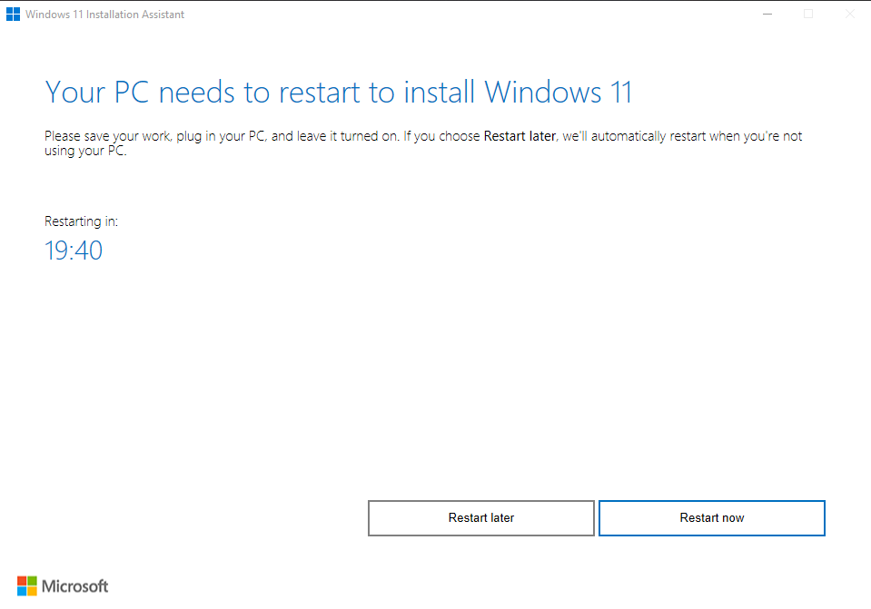
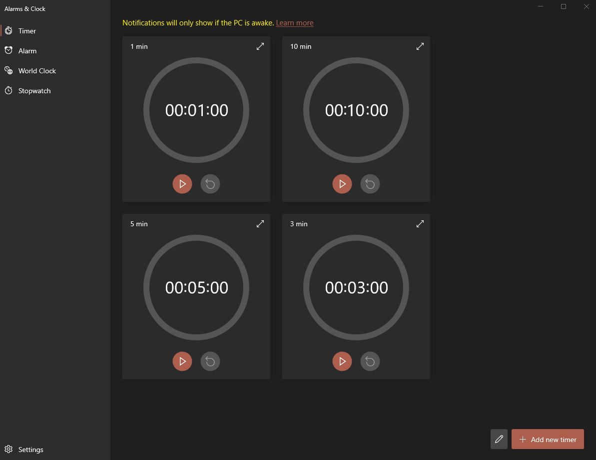
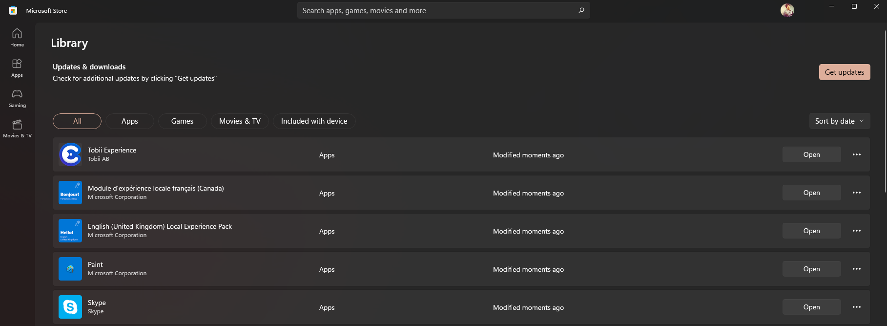
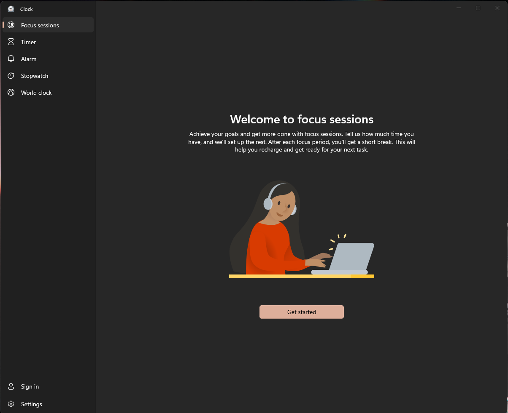
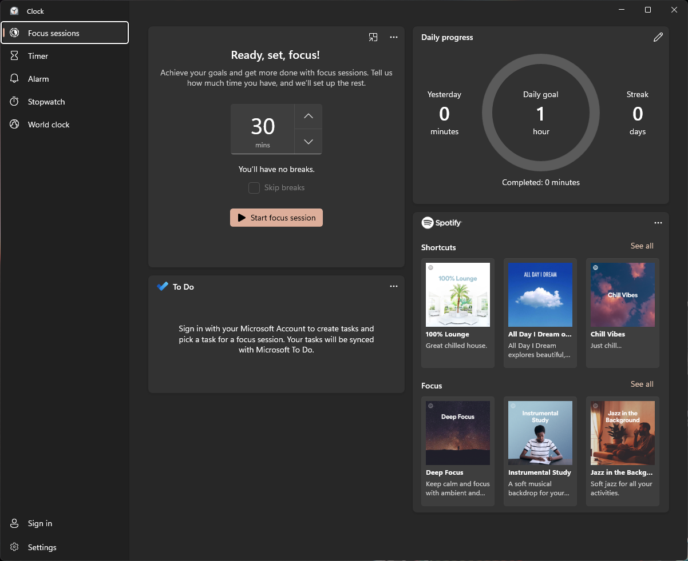
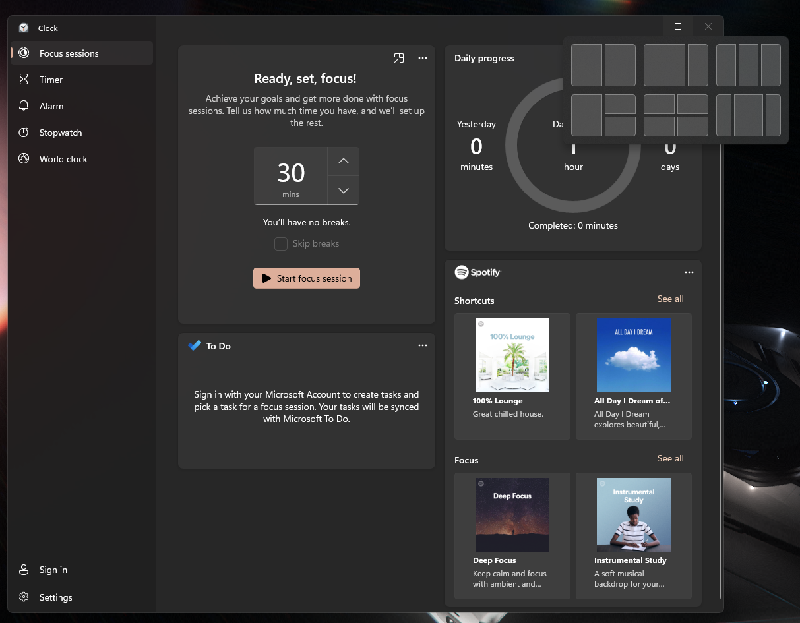
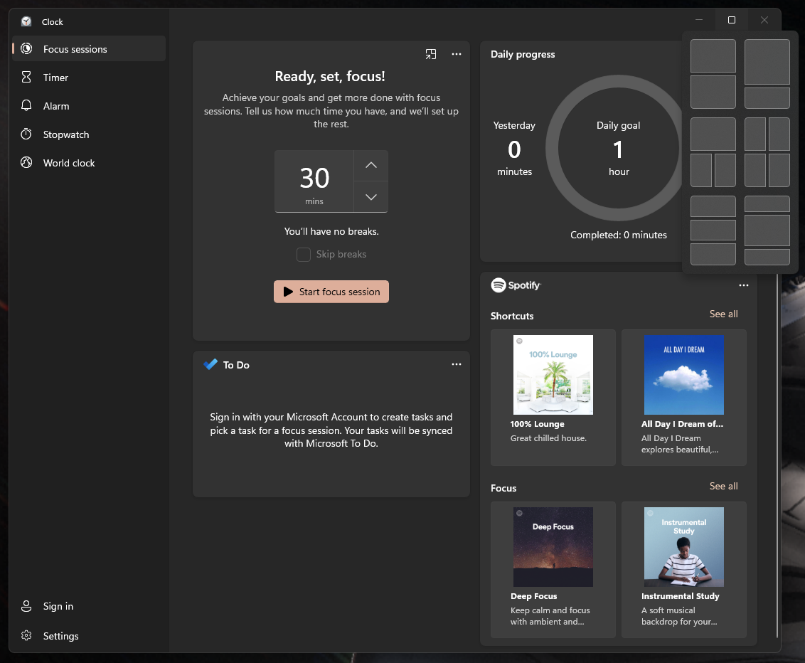

# I'm upgrading to Windows 11

After some initial hesitation, I was convinced to upgrade to Windows 11 after I've seen some of the new features added to the Microsoft OS.

* There's the new Windows snapping tool which reminds me of [Magnet](https://magnet.crowdcafe.com/) on macOS.
* There's a new [Focus Sessions](https://blogs.windows.com/windows-insider/2021/08/19/new-clock-app-for-windows-11-with-focus-sessions-rolling-out-to-windows-insiders/) feature that integrates a Pomodoro timer and Spotify.

I am quite excited to try these new features and this blog post will document my journey from Windows 10 to 11.

<!-- truncate -->

The instructions I followed are here: https://www.microsoft.com/en-ca/windows/get-windows-11

## First Hiccup

The `PC Health Check` app picked up a missing requirement on my system. My bios did not have TPM (Trusted Platform Manager) enabled, so I had to restart my computer to enable it.

## Second Hiccup

The Windows Update tool did not recognize that my PC now meets the Windows 11 requirements. According to the support forums, this issue gets resolved overnight, but I wanted to update now. I had to go and download the [Windows 11 Installation Assistant](https://www.microsoft.com/en-us/software-download/windows11) and execute it.

## Upgrading

With the Installation Assistant, things were simple. After about 30 minutes of installation, I was finally ready to restart.

After the restart, the installation continued for some time. I am not exactly sure how long because I was working out and by the time I was done, the installation finished and I was greeted with the Windows 11 splash screen.

## Third Hiccup

After upgrading, I could not find the Focus Sessions feature. After a quick search, it looks as though the Focus Session feature is integrated inside the `Alarms & Clock` app. However, upon launching the app, the feature was not there.

After some Googling, I found multiple support posts with people having the same issue as I. One of the solutions seemed to be to sign-up to the [Windows Insider Program](https://insider.windows.com/en-us/) and pulling the Development build of Windows 11 to access the feature. This was a no-go for me because I want a stable system and not run beta builds.

Since many of these support requests were from a few months ago, I tried alternative routes. I went to my `Windows Update` and updated my Windows 11 to the most recent build. Still, the feature was not there.

I had all but given up. However, by going to the `Microsoft Store` app on Windows and updating all my applications, the feature was now available!

## Setting up Focus Sessions

The setup was quite painless. I only have to link my Microsoft To-Do account and my Spotify account to the app. Since I was not already using Microsoft To-Do, that field is a bit empty, but I was quite pleased to see that the Spotify integration showed playlists in the Focus category. I'm just not entirely sure whether it's because Focus is a category that I listen to frequently.

## Window Snapping

The window snapping feature named Snap Assist pops up whenever I hover onto the maximize icon on an app's window.

Here's what it looks like for a horizontal display:

And here's what it looks like for a vertical display:

## First Impressions

Windows 11 has rounded windows corners, a centralized taskbar (reminiscent of macOS's dock), and dark mode, just to name a few features that are immediately apparent. I will have to spent more time with the OS to really notice all the different changes. I'm happy to say that nothing has broke so far in my development setup - something that had me worried. However, this could be due to the fact that I use VMWare Workstation 16 Pro to launch my development environment (which runs Manjaro).

I have also noticed that the system sounds are different and modern, which is a welcome change, but will take getting used to after spending so long with Windows 10.

All in all, the process was pretty painless although there were some hiccups.

More information available about Windows 11 available [here](https://www.microsoft.com/en-ca/windows/windows-11)