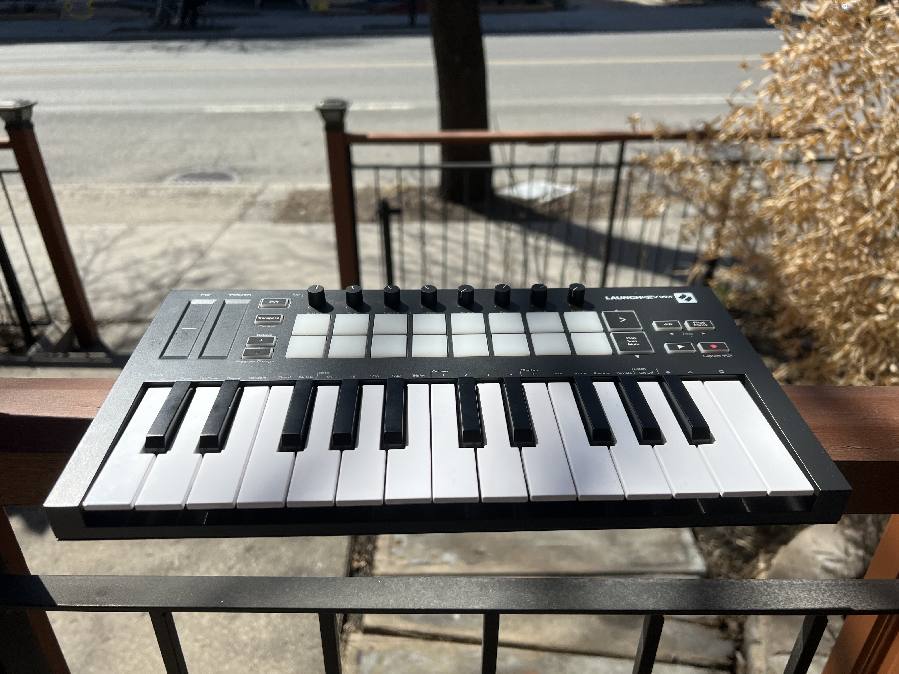

It is pretty fun to make music, but it is even better to have it in a portable package.

I really like Ableton as a desktop DAW but it is unfortunately not available on the iPad. So, there started my quest in finding a DAW with a compatible workflow on the iPad.

I made a [guide](/docs/music/ipad-daws-guides) for some DAW I tested with my trusty Launchkey Mini pictured below.

