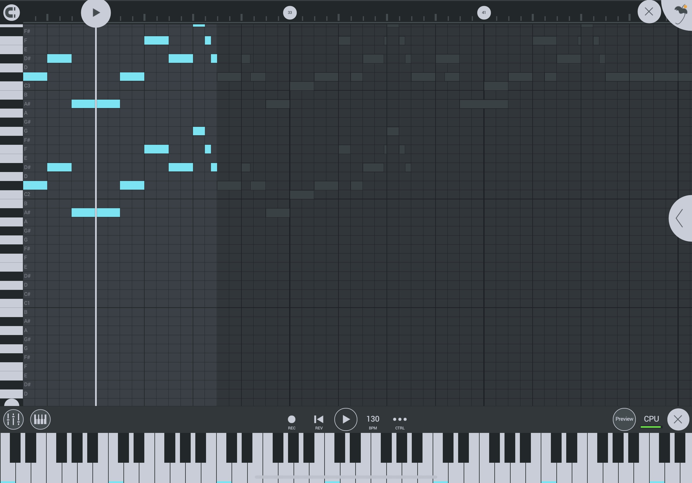

# iPad DAWs guides

_Last updated: April 5 2022_

Digital Audio Workstations (DAWs) apps compared:
  * GarageBand
  * Cubasis 3
  * Korg Gadget 2
  * BeatMaker 3
  * NanoStudio 2
  * FL Studio Mobile

## Session Mode and Arrangement Mode feature 

Here I compare whether the DAW has a session (vertical) mode 

### GarageBand

#### Session Mode

#### Arrangement Mode

### Cubasis 3

No Session Mode on Cubasis 3 unfortunately.

#### Arrangement Mode

### Korg Gadget 2

No Session Mode on Korg Gadget 2 unfortunately.

#### Session Mode

### BeatMaker 3

#### Session Mode

#### Arrangement Mode

### NanoStudio 2

No Session Mode on NanoStudio 2 unfortunately.

#### Arrangement Mode

### FL Studio Mobile

No Session Mode on FL Studio Mobile unfortunately.

#### Arrangement Mode

## Instrument Input Mode

Here I compare the input methods for each DAW.

### GarageBand

#### Drum Pads

#### Keys

#### Piano Roll

### Cubasis 3

#### Drum Pads

#### Keys

#### Piano Roll

### Korg Gadget 2

#### Drum Pads

#### Keys

#### Piano Roll

### BeatMaker 3

#### Drum Pads

#### Keys

#### Piano Roll

### NanoStudio 2

#### Drum Pads

#### Keys

#### Piano Roll

### FL Studio Mobile

#### Drum Pads

#### Keys

#### Piano Roll

## Midi Learn Feature

One of my must-have features for DAWs is the ability to customize the MIDI controls of the application. Usually keys and pads work out of the box (or with some little setup), but Transport controls and various Knobs assignments are not always available.
Transport Control is useful so that we can use the Midi controller to start/stop/record or even start the metronome without reaching for the iPad screen.

### GarageBand

I have not found a way to customize Midi assignments in GarageBand, but the Midi inputs work.
I cannot assign the Transport controls since I cannot customize the Midi controls.

### Cubasis 3

Access the midi learn feature by tapping Settings, then Midi and finally Learn. Transport controls and knobs can be assigned.

### Korg Gadget 2

Access the midi learn feature for the current instrument by tapping Function. Tap the setting you want to assign then nudge it on the midi controller.

The Transport controls can be assigned in the main Settings pop-up.

### BeatMaker 3

Access the midi learn feature by tapping on the Settings icon and then the Midi Focus Actions tab. Transport controls and knobs can be assigned. There is a lot of customizability for Midi controls.

### NanoStudio 2

There is unfortunately no way to assign the Transport Controls as far as I know on NanoStudio 2. That's too bad.

Access the midi learn feature by first going onto the Mixer view. Then double-tap the Instrument name at the bottom. This will take you to a new menu.

From there, it is possible to customize Knobs assignment.

### FL Studio Mobile

There is unfortunately no way to assign the Transport controls as far as I know on FL Studio Mobile. That's too bad.

Open the instrument FX panel and the CTRL menu's options should not be grayed out anymore. Change the setting you want to assign and select the Link to MIDI CC option pictured below. Then you can nudge the control you want to assign the Fader/Knob to.

The settings is greyed out unless there is some FX control for the instrument.